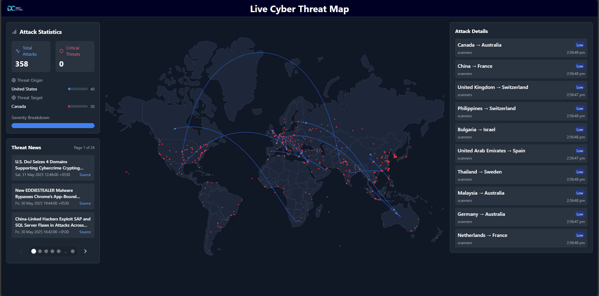

# Live Cyber Threat Map (LCTM)

An interactive, full-stack cyber threat intelligence platform that visualizes global cyber attacks in real time. It aggregates threat data, malicious IPs, and security news from trusted sources, then presents it through an animated world map interface. Built with a Flask backend and a modern React frontend.



---

## About the Project

The Live Cyber Threat Map provides:

- Real-time display of global cyber attacks, enriched with geolocation data
- Animated attack vectors and statistical analysis of threats
- Continuous news updates from multiple cybersecurity RSS feeds
- Mapping of malicious IP addresses with threat classification
- A scalable, asynchronous architecture with REST and SSE APIs

This project helps security analysts, organizations, and the public understand and monitor global cyber activity in an intuitive, engaging way; whether for SOC dashboards to track live threats, security research into attack vectors, or public awareness through interactive demonstrations.

---

## Features

### Backend (Flask + Python)
- Asynchronous threat data collection from FortiGuard and Radware 
- Malicious IP aggregation from AlienVault, BinaryDefense, FraudGuard, and Talos
- Cybersecurity news aggregation from HackerNews, DarkReading, and 420.in RSS
- Additional threat intelligence, mallicious-ips or news sources can be integrated via modular collector classes
- Geolocation and country mapping via MaxMind GeoLite2
- RESTful and SSE endpoints for `/threats`, `/news`, and `/malicious-ips`
- Resilient error handling, retry logic, and deduplication

### Frontend (React + TypeScript)
- Real-time animated threat map using `react-simple-maps` and `d3`
- Dynamic statistics dashboard and severity filters
- Live news feed with flip-card animation
- Efficient data handling via Web Workers and SSE
- Responsive dark-themed UI with Tailwind CSS styling
- Attack vector animation with GSAP

---

## Usage Instructions

### Backend Setup

#### Prerequisites
- Python 3.10+
- Pip

#### Installation
```bash
cd DC_LCTM_Backend
pip install -r requirements.txt
````

#### CORS Configuration (Important for Production)

By default, the backend allows all origins for CORS to enable easy development and frontend-backend integration.
>
> **For production, always restrict CORS to your frontend's domain** for security.

```python
# in `server.py`:

from flask_cors import CORS
CORS(app, resources={
    r"/*": {
        "origins": ["https://your-frontend-domain.com"], # replace with your frontend domain
        "methods": ["GET", "POST", "PUT", "DELETE", "OPTIONS"],
        "allow_headers": ["Content-Type", "Authorization"]
    }
})
```
This ensures only your deployed frontend can access the backend API.

#### Run Server

- For development:

    ```bash
    python server.py
    ```

- For production (recommended):

    ```bash
    gunicorn -w 4 -b 0.0.0.0:5000 server:app
    ```


#### API Endpoints

* `/threats` - Live cyber threat data via Server-Sent Events (SSE)
* `/news` - Filtered cybersecurity news articles (GET)
* `/malicious-ips` - Geolocated malicious IPs (GET)

---

### Frontend Setup

#### Prerequisites

* Node.js (v14 or higher)
* npm or yarn

#### Installation

```bash
cd DC_LCTM_Frontend-v2
npm install
# or
yarn install
```

#### Run Development Server

```bash
npm run dev
# or
yarn dev
```

The frontend will be available at `http://localhost:5173` by default.

---

## Project Structure

### Backend

```
Backend/
├─ assets/
│  ├─ country_coordinates.json   # Centroid coordinates for countries (used in map rendering)
│  └─ GeoLite2-City.mmdb         # MaxMind database for IP geolocation
├─ templates/
│  └─ index.html                 # Fallback HTML page for local API testing
├─ cyber_threat_intel.py        # Core module for data collection and preprocessing
├─ requirements.txt             # Python dependencies list
└─ server.py                    # Flask server providing REST and SSE APIs
```

### Frontend

```
Frontend/
├─ src/
│  ├─ components/
│  │  ├─ AttackVector.tsx      # Visualizes animated cyber attack paths
│  │  ├─ news.tsx              # Displays live cybersecurity news
│  │  ├─ Stats.tsx             # Renders threat statistics panel
│  │  └─ WorldMap.tsx          # Shows real-time interactive map
│  ├─ data/
│  │  ├─ countries.ts          # Country names and ISO code mappings
│  │  ├─ maliciousIPs.ts       # Static IP data for visualization
│  │  └─ threatData.ts         # Parsed threat data for the map
│  ├─ Image/
│  │  └─ logo_DC.png           # Project logo image
│  ├─ types/
│  │  └─ index.ts              # TypeScript interfaces for core data types
│  ├─ workers/
│  │  ├─ newsWorker.ts         # Web Worker to fetch and parse news
│  │  └─ threatWorker.ts       # Web Worker to fetch and animate threat data
│  ├─ App.tsx                  # Main React app wrapper
│  ├─ index.css                # Global styles using Tailwind CSS
│  ├─ main.tsx                 # App entry point
│  └─ vite-env.d.ts            # Type support for environment variables
├─ .gitignore                  # Files/directories excluded from Git versioning
├─ eslint.config.js           # Linting rules and config
├─ index.html                 # Base HTML template used by Vite
├─ package-lock.json          # Auto-generated file locking package versions
├─ package.json               # Dependency list, scripts, and metadata
├─ postcss.config.js          # PostCSS setup for Tailwind CSS
├─ README.md                  # Project usage and documentation file
├─ tailwind.config.js         # Tailwind CSS configuration (theme, colors, etc.)
├─ tsconfig.app.json          # TypeScript settings for app code
├─ tsconfig.json              # Base TypeScript configuration
├─ tsconfig.node.json         # TypeScript settings for Node-related tooling
└─ vite.config.ts             # Vite configuration for dev/build environments
```

---

